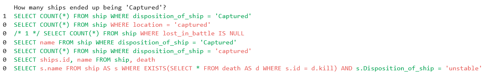

# SQL-AST Classification Data

## Example:

Assume we have a question and several SQL queries:


Only the first one answers the question correctly. This can be seen by the 1 on the left, indicating  a positive label.

The other queries have some errors that can be labeled with this repository. It uses the AST difference compared to the correct query to generate a label for each AST node:



## Installation
```.sh
poetry shell
poetry install --all-extras
```

## AST Data generation
```.py
# Imports
from sql_ast_dataset.ast_processing.factory import Factory
from sql_ast_dataset.ast_processing.ast_diff_types import ASTDiffInput
from typing import List

# Method to process the queries
query_processor = Factory().build("QueryProcessor", {}) 

# Generating the AST Classification data
ast_diff:ASTDiffInput = query_processor.process(
    sql_query_1 = "/* 1 */ SELECT COUNT(*) FROM ship WHERE lost_in_battle IS NULL",
    sql_query_2 = "SELECT COUNT(*) FROM ship WHERE location = 'captured'",
    label = 0
)

# The AST nodes as char indices
subword_indices: List[List[int]] = ast_diff.query_subword_indices_as_list()
# The label for each AST node
subword_labels: List[int] = ast_diff.get_labels()
```

# Notebook
A simple notebook can be found under [/notebooks/](notebooks). 
It contains an example how to visualize the generated data.